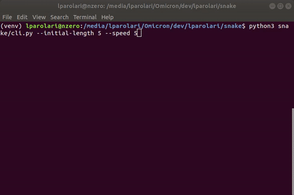
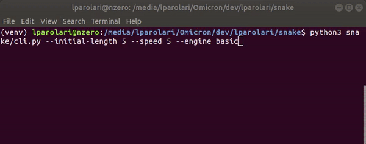

# Snake on Terminal


> A simple snake game on terminal with focus on well design, reuse and best practise.






## Usage

Play with snake
```
# run the game with defaults
snake

# or with custom options
snake --rows-no 40 --cols-no 80 --speed 5 --initial-length 8

```

For list of options and documentation run
```bash
snake --help  # shows the options list and some docs.
```


## Installation

Install with pip
```bash
pip install XXX
```

Install with git
```bash
git clone https://github.com/lparolari/snake
cd snake
python3 setup.py install
```


## Author

- Luca Parolari <<luca.parolari23@gmail.com>>


## License

This software is MIT Licensed. See [LICENSE](LICENSE) file.
