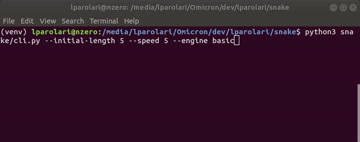

Snake on Terminal
=================

.. image:: https://img.shields.io/pypi/v/snake.svg
.. image:: https://img.shields.io/travis/lparolari/snake.svg
.. image:: https://readthedocs.org/projects/snake/badge/?version=latest

*A simple snake game on terminal with focus on well design, reuse and best practise.*

*Asciimatics* engine, redraws terminal.

.. image:: snake-1.gif

*Basic* engine, uses normal prints.

Usage
-----

Play with snake

.. code::

    # run the game with defaults
    snake

    # or with custom options
    snake --rows-no 40 --cols-no 80 --speed 5 --initial-length 8

For list of options and documentation run

.. code::

    snake --help  # shows the options list and some docs.

Installation
------------

Install with pip

.. code ::

    pip3 install snake-terminal-pp

Install with git

.. code ::

    git clone https://github.com/lparolari/snake
    cd snake
    python3 setup.py install

Author
------

- Luca Parolari <luca.parolari23@gmail.com>

License
-------

This software is MIT Licensed. See LICENSE_ file.
